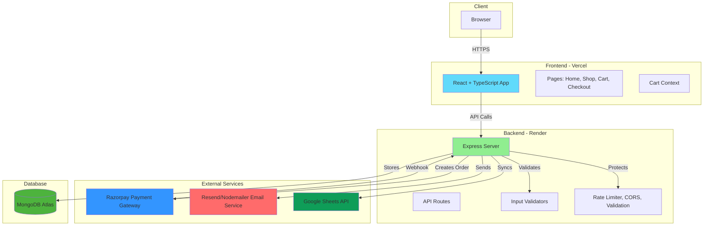
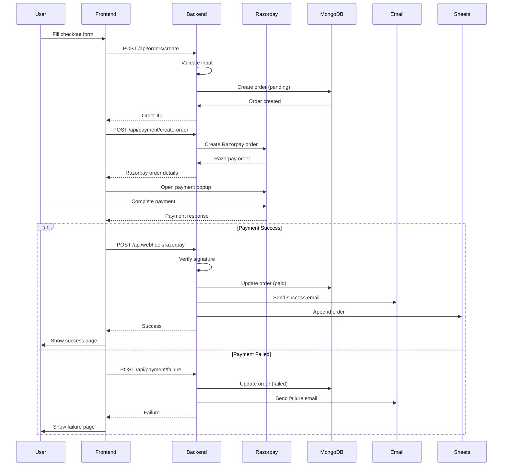

# 🌿 Prakriti Pure – Full Stack E-commerce Platform

Prakriti Pure is a **production-ready full-stack e-commerce application** built with modern MERN architecture, featuring secure payments, professional email notifications, and streamlined order management.

---

## 📋 Table of Contents

- [Features](#-features)
- [Tech Stack](#-tech-stack)
- [Architecture](#-architecture)
- [Project Structure](#-project-structure)
- [Getting Started](#-getting-started)
- [Environment Variables](#-environment-variables)
- [Payment Flow](#-payment-flow)
- [Security Features](#-security-features)
- [Email System](#-email-system)
- [Google Sheets Integration](#-google-sheets-integration)
- [Deployment](#-deployment)
- [Roadmap](#-roadmap)
- [Contributing](#-contributing)
- [License](#-license)

---

## ✨ Features

### 🛍️ Frontend (React + TypeScript + Vite)

- **Modern Responsive UI** - Desktop and mobile optimized
- **Product Catalog** - Product listing, details, and search
- **Shopping Cart** - Context-based cart management
- **Checkout Flow** - Form validation and secure payment integration
- **Payment Integration** - Razorpay UPI & Card payments
- **Success/Failure Pages** - Professional payment result pages
- **Toast Notifications** - User-friendly feedback system
- **TypeScript** - Type-safe development

### ⚙️ Backend (Node.js + Express)

- **RESTful API** - Clean API architecture
- **MongoDB Database** - Mongoose ODM for data modeling
- **Payment Processing** - Razorpay integration with webhook support
- **Email Notifications** - Professional HTML email templates
- **Google Sheets Sync** - Automated order tracking
- **Input Validation** - Server-side validation with express-validator
- **Rate Limiting** - DDoS and abuse protection
- **CORS Security** - Environment-based origin validation
- **Environment Validation** - Startup configuration checks

### 📊 Admin (Google Sheets)

- **Auto-sync Orders** - Orders automatically appended after payment
- **Manual Fulfillment** - Toggle order completion status
- **Zero Database Risk** - Read-only sync, database remains source of truth

---

## 🧱 Tech Stack

### Frontend
- **React 18+** with **Vite**
- **TypeScript** for type safety
- **Tailwind CSS** for styling
- **React Router** for navigation
- **Axios** for API calls
- **Sonner** for toast notifications
- **Lucide React** for icons
- **Radix UI** components

### Backend
- **Node.js** runtime
- **Express.js** web framework
- **MongoDB** with **Mongoose** ODM
- **Razorpay SDK** for payments
- **Resend/Nodemailer** for emails
- **Google Sheets API** for order tracking
- **express-validator** for input validation
- **express-rate-limit** for rate limiting

### Infrastructure
- **Frontend:** Vercel
- **Backend:** Render
- **Database:** MongoDB Atlas

---

## 🏗️ Architecture



### Request Flow

1. **User Action** → Frontend makes API request
2. **Rate Limiting** → Middleware checks request rate
3. **CORS Validation** → Origin is validated
4. **Input Validation** → Request data is validated
5. **Business Logic** → Route handler processes request
6. **Database** → Data is stored/retrieved from MongoDB
7. **External Services** → Payment/Email/Sheets as needed
8. **Response** → JSON response sent to frontend

---

## 📁 Project Structure

```
prakriti-pure/
├── src/                          # Frontend source
│   ├── pages/                   # Page components
│   │   ├── HomePage.tsx
│   │   ├── ShopPage.tsx
│   │   ├── ProductDetailsPage.tsx
│   │   ├── CartPage.tsx
│   │   ├── CheckoutPage.tsx
│   │   ├── PaymentSuccess.tsx
│   │   └── PaymentFailed.tsx
│   ├── components/              # Reusable components
│   │   ├── ui/                 # UI primitives (Radix UI)
│   │   ├── Navigation.tsx
│   │   ├── Footer.tsx
│   │   └── ProductCard.tsx
│   ├── context/                # React Context
│   │   └── CartContext.tsx
│   ├── types/                  # TypeScript types
│   ├── data/                   # Static data
│   └── App.tsx
│
├── backend/                     # Backend source
│   ├── config/                 # Configuration
│   │   ├── db.js              # MongoDB connection
│   │   └── razorpay.js        # Razorpay instance
│   ├── models/                 # Mongoose models
│   │   └── Order.js
│   ├── routes/                 # API routes
│   │   ├── orderRoutes.js
│   │   ├── webhookRoutes.js
│   │   └── testRoutes.js
│   ├── validators/             # Input validators
│   │   ├── orderValidator.js
│   │   └── paymentValidator.js
│   ├── middlewares/            # Express middlewares
│   │   ├── rateLimiter.js
│   │   └── validate.js
│   ├── utils/                  # Utility functions
│   │   ├── sendEmail.js
│   │   ├── googleSheets.js
│   │   ├── paymentSuccess.js
│   │   └── paymentFailure.js
│   ├── env.js                  # Environment loader
│   └── server.js               # Express app entry
│
├── public/                     # Static assets
│   └── images/                 # Product images
│
├── IMPROVEMENT_REPORT.md        # Detailed improvement analysis
└── README.md                    # This file
```

---

## 🚀 Getting Started

### Prerequisites

- **Node.js** 18+ and npm
- **MongoDB Atlas** account (or local MongoDB)
- **Razorpay** account (test/live mode)
- **Google Cloud** account (for Sheets API)
- **Resend** account (for emails) or SMTP credentials

### Installation

1. **Clone the repository**
   ```bash
   git clone <https://github.com/KrishnaNsingh/Prakriti-pure.git>
   cd Prakriti_pure
   ```

2. **Install frontend dependencies**
   ```bash
   npm install
   ```

3. **Install backend dependencies**
   ```bash
   cd backend
   npm install
   ```

4. **Set up environment variables** (see [Environment Variables](#-environment-variables))

5. **Start development servers**

   **Frontend:**
   ```bash
   npm run dev
   ```

   **Backend:**
   ```bash
   cd backend
   npx nodemon server.js
   ```

---

## 🔐 Environment Variables

### Frontend `.env`

Create a `.env` file in the root directory:

```env
VITE_API_BASE_URL=http://localhost:5000
VITE_RAZORPAY_KEY_ID=rzp_test_xxxxxxxxx
```

> ⚠️ **Important:** Frontend env variables **must start with `VITE_`** to be accessible in the app.

### Backend `.env`

Create a `.env` file in the `backend/` directory:

```env
# Server
PORT=5000

# Database
MONGO_URI=mongodb+srv://<username>:<password>@cluster.mongodb.net/prakritiPureDB

# Razorpay
RAZORPAY_KEY_ID=rzp_test_xxxxxxxxx
RAZORPAY_KEY_SECRET=xxxxxxxxx
RAZORPAY_WEBHOOK_SECRET=your_webhook_secret

# CORS
ALLOWED_ORIGINS=http://localhost:5173,https://yourdomain.com

# Email (Resend - Recommended)
RESEND_API_KEY=re_xxxxxxxxx

# OR Email (SMTP)
EMAIL_USER=your_email@example.com
EMAIL_PASS=your_email_password_or_api_key

# Google Sheets
GOOGLE_SHEET_ID=xxxxxxxxxxxxxxxxxxxx
GOOGLE_SERVICE_ACCOUNT={JSON_STRING_HERE}
# OR
GOOGLE_SERVICE_ACCOUNT_BASE64=base64_encoded_json_string
```

> ⚠️ **Security:** Never commit `.env` files. The server validates required variables on startup.

---

## 💳 Payment Flow



### Webhook Support

The application supports Razorpay webhooks for reliable payment event handling:
- `payment.captured` - Payment success
- `payment.failed` - Payment failure
- Prevents duplicate processing
- Graceful error handling

---

## 🛡️ Security Features

### ✅ Implemented

- **Input Validation** - Server-side validation using express-validator
  - Email format validation
  - Phone number validation (Indian format)
  - Required field checks
  - Data type validation
  
- **CORS Protection** - Environment-based origin validation
  - Only allows configured origins
  - Supports server-to-server requests
  - Credentials enabled for authenticated requests

- **Rate Limiting** - DDoS and abuse protection
  - 100 requests per 15-minute window per IP
  - Applied to all `/api/` routes
  - Webhooks excluded (as required)

- **Environment Validation** - Startup configuration checks
  - Validates critical variables on server start
  - Fails fast with clear error messages
  - Prevents runtime failures

- **Payment Security** - Secure payment processing
  - Signature verification on backend
  - Payment status checks to prevent duplicates
  - Webhook signature validation

- **Secrets Management** - Environment variables only
  - No hardcoded secrets
  - `.gitignore` configured
  - Service account keys in env vars

### 🔄 Planned

- Payment amount verification before marking as paid
- Transaction locking for race condition prevention
- Enhanced error handling middleware
- Request logging and monitoring

---

## 📧 Email System

### Features

- **Professional HTML Templates** - Branded, responsive design
- **Payment Success Email** - Complete order confirmation with:
  - Order ID, date, and payment ID
  - Itemized product list
  - Pricing breakdown
  - Shipping address
  - Shipping timeline (3-5 business days)

- **Payment Failure Email** - Helpful failure notification with:
  - Order details
  - Failure explanation
  - Next steps for retry
  - Support information

### Email Providers

- **Resend** (Recommended) - Modern email API
- **Nodemailer** - SMTP support for custom servers

> **Note:** Production emails require a **custom domain** when using Resend.

---

## 📊 Google Sheets Integration

### Features

- **Auto-sync** - Orders automatically appended after successful payment
- **Comprehensive Data** - Each row includes:
  - Order ID (MongoDB ObjectId)
  - Customer details (name, email, phone)
  - Product breakdown (names, quantities)
  - Total quantity and amount
  - Payment status and payment ID
  - Order date (IST timezone)
  - Full shipping address
  - Fulfillment status (manual dropdown)

### Setup

1. Create a Google Cloud Project
2. Enable Google Sheets API
3. Create a Service Account
4. Download service account JSON key
5. Share your Google Sheet with the service account email
6. Add JSON as `GOOGLE_SERVICE_ACCOUNT` environment variable

> ⚠️ **Important:** Google Sheets is **read-only for admin tracking** — it does NOT sync back to the database. The database is the single source of truth.

---

## 🚀 Deployment

### Frontend (Vercel)

1. Push repository to GitHub
2. Import project into Vercel
3. Add environment variables:
   - `VITE_API_BASE_URL`
   - `VITE_RAZORPAY_KEY_ID`
4. Deploy

### Backend (Render)

1. Create a new Web Service on Render
2. Connect your GitHub repository
3. Set build command: `npm install`
4. Set start command: `node server.js`
5. Add all backend environment variables
6. Deploy

> ⚠️ **Note:** Render free tier sleeps after 15 minutes of inactivity. Consider upgrading for production use.

### Database (MongoDB Atlas)

1. Create MongoDB Atlas cluster
2. Whitelist Render/Vercel IPs (or use `0.0.0.0/0` for development)
3. Create database user
4. Copy connection string to `MONGO_URI`

---

## 🗺️ Roadmap

### ✅ Completed (January 2025)

- ✅ Input validation with express-validator
- ✅ CORS configuration with environment variables
- ✅ Environment variable validation on startup
- ✅ Rate limiting implementation
- ✅ Professional payment success email template
- ✅ Professional payment failure email template
- ✅ Payment success page redesign
- ✅ Webhook payment processing improvements
- ✅ Code quality improvements

### 🔴 High Priority

- [ ] Payment amount verification before marking as paid
- [ ] Race condition handling in payment verification
- [ ] Structured error handling middleware
- [ ] Request logging (Morgan/Winston)

### 🟡 Medium Priority

- [ ] Cart persistence with localStorage
- [ ] Frontend form validation enhancement (react-hook-form)
- [ ] API response standardization
- [ ] Health check endpoint
- [ ] Backend TypeScript migration (or JSDoc annotations)

### 🟢 Nice-to-Have

- [ ] Loading states for API calls
- [ ] Error boundaries in React
- [ ] SEO meta tags
- [ ] Image optimization (WebP, lazy loading)
- [ ] Code splitting
- [ ] Unit and integration tests
- [ ] CI/CD pipeline

### 🎯 Feature Additions

- [ ] User authentication
- [ ] Order tracking page
- [ ] Product reviews and ratings
- [ ] Admin dashboard
- [ ] Product search and filtering
- [ ] Email subscription

> 📊 See [IMPROVEMENT_REPORT.md](./IMPROVEMENT_REPORT.md) for detailed analysis.

---

## 🤝 Contributing

We welcome contributions! Here's how you can help:

1. **Fork the repository**
2. **Create a feature branch**
   ```bash
   git checkout -b feature/your-feature-name
   ```
3. **Make your changes** and test thoroughly
4. **Commit with clear messages**
   ```bash
   git commit -m "Add: description of your changes"
   ```
5. **Push and submit a pull request**

### Guidelines

- ✅ Ensure no secrets are committed (check `.env` files)
- ✅ Follow existing code style and patterns
- ✅ Add comments for complex logic
- ✅ Test your changes before submitting PR

---

## 📚 Documentation

- [IMPROVEMENT_REPORT.md](./IMPROVEMENT_REPORT.md) - Detailed codebase analysis and improvements
- [Razorpay Documentation](https://razorpay.com/docs/)
- [MongoDB Atlas Documentation](https://docs.atlas.mongodb.com/)
- [Google Sheets API Documentation](https://developers.google.com/sheets/api)

---

## 🧡 Acknowledgements

Built with modern full-stack engineering practices and production-ready architecture.

**Special Thanks:**
- Razorpay for payment infrastructure
- Google Sheets API for simple admin tracking
- The open-source community for amazing tools

---

## 📄 License

MIT License

---

## 📞 Support

For issues, questions, or suggestions:
- Open an issue on GitHub
- Check the [IMPROVEMENT_REPORT.md](./IMPROVEMENT_REPORT.md) for known issues

---

**Prakriti Pure** — Clean code. Clean UX. Clean products 🌿

*Last updated: January 2025*
